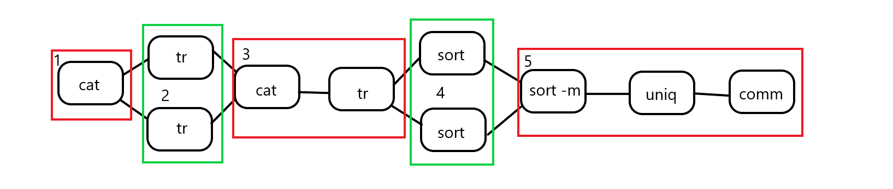

# Overview

This is a serverless parallelization of the [`spell` script](https://github.com/nikpag/pash/blob/main/evaluation/intro/demo-spell.sh), with parallelization factor equal to 2. The following AWS services are used:

- Lambda for function invocation
- S3 for data exchange between lambdas
- DynamoDB for coordination between parallel lambdas (i.e. lambdas that are part of the same parallel operation).

An abstracted depiction of the workflow looks like this:



Each number 1-5 corresponds to a different shell script that each lambda must run. Note that lambdas enclosed in green rectangles run the same script, but each operates on a different slice of the data.

# Prerequisites

- A slight idea of how AWS Lambda works. AWS S3, DynamoDB and SQS are also nice to have.
- An AWS account. The free tier is more than enough.
- AWS CLI installed on your machine.

# Setup

You need to configure an AWS role for Lambdas, so they can:

- Invoke other lambdas
- Upload and download from S3
- Read and write to DynamoDB
- Send messages to SQS

For this, you need to run `./roles.sh`, **after editing it** to match your AWS account info. You should also edit the `Resource:` field in the `policies/` folder so it matches your preferred AWS region, your AWS account ID, as well as any service-specific item, such as S3 buckets or DynamoDB tables.

# How to run

If it's the first time you run this example, make sure to run the `./initial-setup.sh` script first. This handles the necessary creation of things like DynamoDB tables and S3 buckets which will be used later on. Again, **you must change it** in order to match your AWS account.

Every time you want to run the example, you should also execute the `./setup.sh` script. This makes sure your function configuration is up to date.

After that, you are all set to run `./main.sh`.

It is **strongly recommended** to always run the two scripts together:

```bash
./setup.sh && ./main.sh
```

to make sure all changes to your function configuration are reflected to AWS, thus saving you from a lot of head-scratching.
